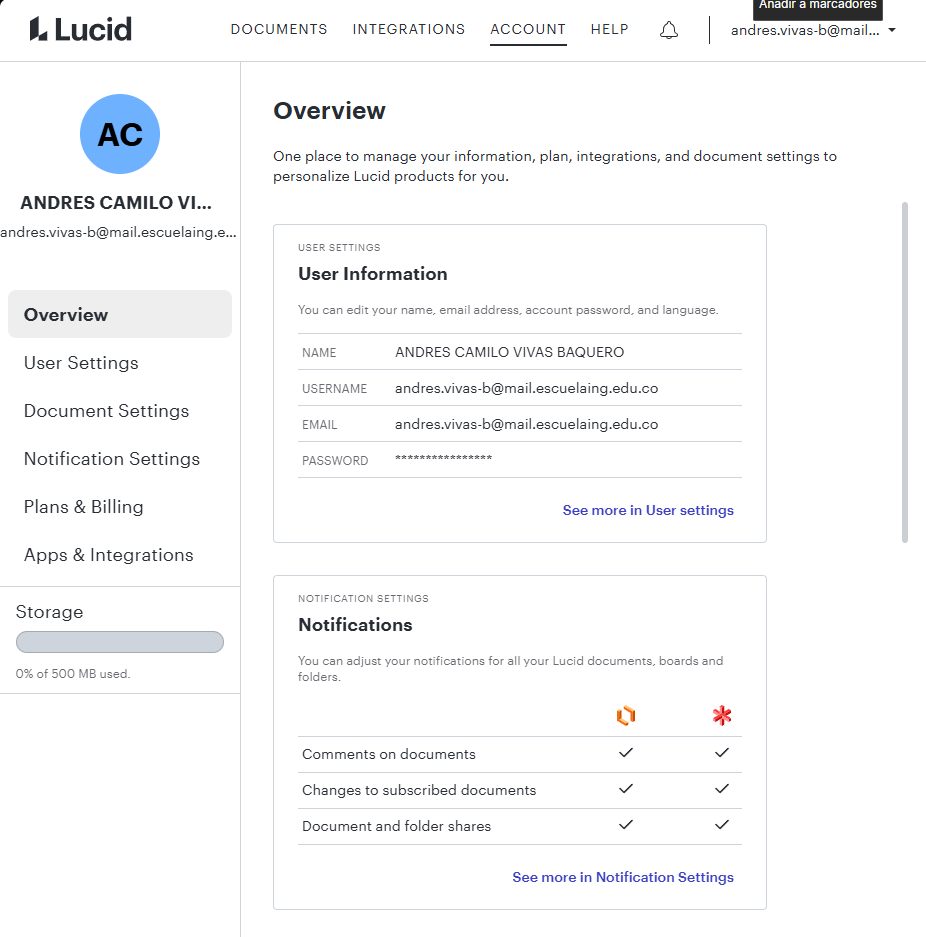
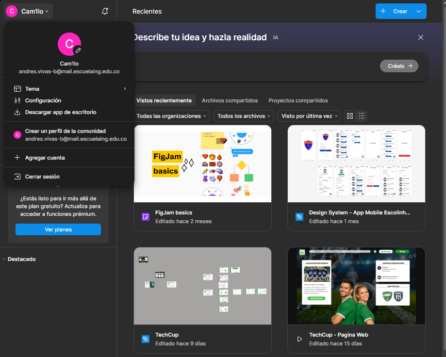
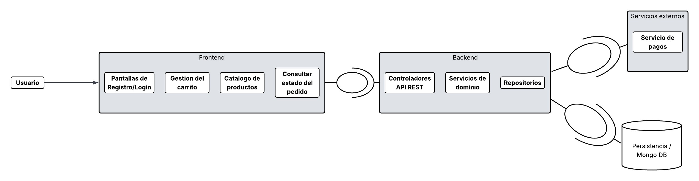

# DOSW - Parcial T2

**Andrés Camilo Vivas Baquero** 
**Andres Sabogal**

***PUNTOS PARA EL PARCIAL - Andres Vivas : +0,2***

**Grupo 1** 

## Herramientas de modelado

## Herramienta de diseño

# PARTE TEORICA

## Punto 1

### Identificacion de funcionalidades

a. Que tipo de verbo HTTP Maneja

b. Establezca si es una funcionalidad idempotente o no

c. Cuál es la razón técnica de su decisión.

d. Cuáles Roles de los identificados tienen acceso a esa funcionalidad

e. Mencione sus datos de entrada y de salida (Establezca de qué tipo
es cada propiedad y si es obligatorio o no)

f. De un ejemplo de cómo se vería la entrada y la salida.

g. Establezca qué validaciones de input y el negocio debe tener en
cuenta.

h. Establezca los códigos HTTP y mensaje para Happy Path y Flujo de
Error

- F-O1 Registro de usuario 

Verbo HTTP - POST

Idempotente - No

Razon - Cada llamada crea un nuevo recurso en base de datos. Múltiples requests con el mismo email deben retornar error, no el mismo resultado.

Roles con acceso - Cliente

Datos entrada:  

Name: "string", - Obligatorio 

Mail: "String" , - Obligatorio

password: "String" - Obligatorio

Datos Salida - Mensaje de confirmacion al usuario de creacion de perfil exitosa 

Ejemplo de entrada: 

{
"name": "Andres Vivas ",

"email": "andres.vivas-b@mail.escuelaing.edu.co ",

"password": "Contraseña123"
}

Ejemplo de salida: 

{
"id": "uuid",

"name": "Andres Vivas",

"email": "andres.vivas-b@mail.escuelaing.edu.co",

"createdAt": "2025-04-10T12:00:00Z"
}

Validaciones input - nombre no vacío, email con formato válido, contraseña mínimo 8 caracteres con al menos 1 número.

Validaciones output - el email no debe estar registrado previamente.

Codigos HTTP, mensaje happy path y flujo de error

Happy Path - 201 Created - Usuario registrado exitosamente

Email - ya existe - 409 Conflict - El correo ya está registrado

Datos inválidos - 400 Bad Request - Campo inválido

Error servidor - 500 Internal Server Error - Error interno del servidor

- F-O2 Login Usuario/ Autenticacion

Verbo HTTP - POST

Idempotente - No

Razon - Genera un token nuevo en cada llamada, aunque las credenciales sean las mismas.

Roles con acceso - Cliente / Señora cafeteria

Datos entrada:

Mail: "String" , - Obligatorio

password: "String" - Obligatorio

Datos Salida - Se genera un token y el codigo del usuario 

Ejemplo de entrada:

{

"email": "string",

"password": "string"

}

Ejemplo de salida:

{

"token": "eyJhbGciOiJIUzI1NiJ9...",

"userId": "uuid",

}

Validaciones input - email y password no vacíos, email con formato válido.

Validaciones output - las credenciales deben coincidir con un usuario registrado y activo..

Codigos HTTP, mensaje happy path y flujo de error

Happy Path	200 OK	—

Credenciales incorrectas	401 Unauthorized	Credenciales inválidas

Datos inválidos	400 Bad Request	El campo email es obligatorio

- F-O3 Los productos pueden ser consultados mediante escaneo de código QR

Verbo HTTP - GET

Idempotente - Si

Razon - GET nunca modifica estado del servidor. Múltiples llamadas iguales retornan el mismo resultado.

Roles con acceso - Cliente

Datos entrada:

Datos Salida - Autorizacion: Bearer token

Ejemplo de entrada:

{

ID-Codigo-QR: "Uuid"

}

Ejemplo de salida:

{

}

Validaciones - solo devolver productos con status disponible.

Codigos HTTP, mensaje happy path y flujo de error

Happy Path - 200 OK	— Lista de productos disponibles

Sin autenticación - 401 Unauthorized - Token requerido

Error servidor - 500 Internal Server Error - Error al consultar productos

- F-O4 Los usuarios puede crear un pedido agregando productos escaneados.

Verbo HTTP - POST

Idempotente - NO

Razon - Cada llamada puede acumular cantidades o crear nuevas entradas en el carrito.

Roles con acceso - Cliente

Datos entrada: id del producto, cantidad del producto a pedir 

Datos Salida - Autorizacion: Bearer token y informacion del pedido 

Ejemplo de entrada:

{
"productId": "uuid",

"quantity": "integer"
}

Ejemplo de salida:

{
"productId": "uuid",

"productName": "Cafe con leche",

"quantity": 2,

"unitPrice": 2500,

"subtotal": 5000
}

Validaciones - solo devolver productos con status disponible.

Codigos HTTP, mensaje happy path y flujo de error

Happy Path - 200 OK	— Lista de productos disponibles

Sin autenticación - 401 Unauthorized - Token requerido

Error servidor - 500 Internal Server Error - Error al consultar productos

- F-O5 El administrador puede cambiar el estado del pedido a:
  ○ EN_PREPARACION
  ○ ENTREGADO

Verbo HTTP - PUT

Idempotente - Si

Razon - PUT reemplaza el recurso completo. Múltiples llamadas con el mismo body producen el mismo estado.

Roles con acceso - Administrador 

Datos entrada: id del producto, cantidad del producto a pedir

Datos Salida - Autorizacion: Bearer token y informacion del pedido

Ejemplo de entrada:

{
"cambioEstadoProducto" : "Disponible"
}

Ejemplo de salida:

{

"productId": "Disponible"

}

Validaciones - Revisar si un producto en estado de disponible, no se pueda cambiar a su mismo estado actual

- F-O6 El cliente puede cancelar el pedido solo en estado CREADO.

- Verbo HTTP - PUT

Idempotente - SI

Razon - PUT reemplaza el recurso completo. Múltiples llamadas con el mismo body producen el mismo estado.

Roles con acceso - Cliente

Datos entrada: Estado del pedido 

Datos Salida - Mensaje de confirmacion de cancelacion de pedido 

Ejemplo de entrada:

{
"estadoPedido": "CREADO"
}

Ejemplo de salida:

{

}

Validaciones - solo cancelar pedido si su estado es CREADO 

### Punto 2
La diferencia es que las validaciones de input validan el formato, tipo y obligaciones; mientras que las validaciones de negocio validan reglas del sistema o dominio como tal.

Por ejemplo las validaciones de input validan cosas como email valido y las validaciones de negocio validan que sea email institucional o no este duplicado.

### Punto 3

- Autenticacion: Es el proceso por el cual se verifica la identidad del usuario o cliente que intenta acceder a la API

- Autorizacion: Es la forma en la que se define como tal que es lo que puede hacer el usuario dentro del sistema luego de ser autenticado 

- Integridad: Es la verificacion que garantiza que los datos no se han modificado o alterado durante una transmicion de datos o almacenamiento

La autenticacion dice quien es el usuario, la autorizacion define que puede hacer el usuario y la integridad revisa si el mensaje o dato llego correctamente y completo como fue enviado.

### Punto 4

### Punto 5

- Si no se maneja un buen orden o separacion de capas dentro de un proyecto de software 
se puede complicar el proyecto a la hora de extenderlo, leerlo y entenderlo a nivel de 
codificacion, el equipo se confudira y no lograra manejar bien todo el proyecto, por lo que no se cumplirian con algunos principios SOLID.

### Punto 7

- Servicios: Es el que se encarga de tener reglas de la logica de negocio.

- Utilidades: Son quienes contienen las funciones que no dependen directamente de las reglas de negocio, no tienen persistencia ni logica de negocio muy importante.

- Validadores: Verifican que los datos cumplen con ciertas reglas de negocio antes de ser procesados.

Los servicios manejan la logica del negocio, las utilidades manejan funciones que no dependen de esta logica de negocio y los validadores verifican que los datos cumplan con las reglas del negocio.